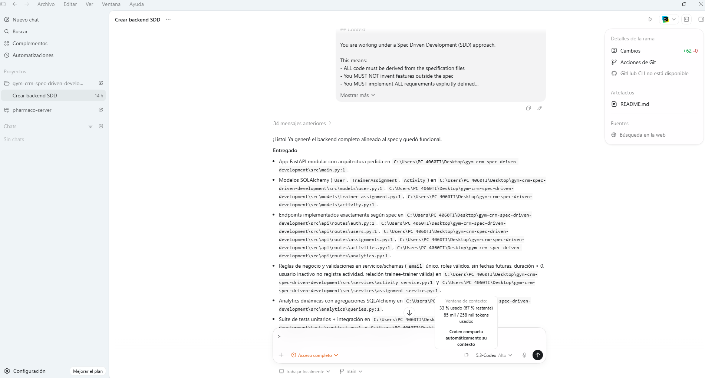

# First Iteration of the Spec Driven Development:

## Choosing the project idea:

I choose a Gym Crm project idea to have already a base to compare the results from the Spec Driven Development iteration
against my own production code. The original idea can be found in: https://github.com/camanrofo34/gym-crm.

This was a project part of the **[Specialization] Java, Part 1. Classic, LatAm #13 course by EPAM**, with the task of building a 
**Gym Management Application** for common administrative actions inside a gym. The original requirements were:

- User Registration
  - Both trainees and trainers can register their profiles.
  - Trainees can select one or more trainers during registration or profile update.
- Authentication
  - Login credentials are mandatory to access any section of the application except the registration page.
  - Separate access for trainees and trainers.
- Profile Management
  - Modify profile information.
  - Activate or deactivate user profiles (both trainees and trainers).
- Activity Logging
  - Users (trainees and trainers) can log their gym activities.
  - Activities can be reviewed both from the trainee and trainer perspectives.
- Trainer Performance Metrics
  - For each trainer, the system calculates the total duration of their training weekly.

The original stack of technologies used included Java with Spring Boot, with Maven for the project build. Included JUnit
with Mockito for the testing (unit, integration and acceptance), MySQL for the relational data, plus MongoDB for the analytics
data. Also, the architecture of the application was based on microservices, with async communication with Active MQ.

The project idea was reduced to easier terms for the Spec Driven Development, while having the original idea, and the idea
that the code developed by the AI based on the design definition could be used by a real gym to manage their CRM. 
So, the project idea was reduced in the following way:
- The architecture of the application was reduced to a client-server architecture, developing a REST API.
- The database was reduced to the idea of a relational database, but to reduce the possibility of connection and validation, 
it was replaced by an SQLite database.
- The stack was changed from Java with Spring Boot to Python with FastAPI, so the library management was simplified.

## Generating the Requirements List:

Taking into account the project was already developed in a specialization course, it already had a requirement list, with
almost all the necessary data for the Spec Driven Development. The requirement list was corrected taking into account the 
new technology stack plus reducing complexity to have a better first approach.

- The product spec can be found in: [Product Specification](../specs/product.spec.md). Where the global design was defined.
- The requirement list can be found in: [Requirement List](../specs/requirements.spec.json). Where the requirements were 
defined in JSON format, including the necessary data for the Spec Driven Development, like the version, the endpoint definition
with their routes and the body, the business rules, the acceptance criteria and the acceptance tests percentage expected.

## The first prompt:

The first prompt can be found in: [Prompt 1](../prompts/prompt_initial.md).

In this prompt, the AI was asked to create a REST API for a Gym Management Application. This prompt included the package where
the Requirement List was located, plus including obligations to prevent hallucinations to the original idea.

Unfortunately, the Git repository couldn't be connected to an external AI service for the exam expected pipeline, this due 
to recent OpenAI API changes, eliminating the GitHub AI Cloud integration on the GitHub Education Plan. Also, the OpenAI
for ChatGPT didn't include free credits to use an API Key for the connection; the same was for ClaudeCode and DeepSeek.

To try to solve this problem, while not changing the organization to use a local model AI service, the solution was to use
ChatGPT Codex, so the AI agent could connect directly to the files directory and edit it directly.

This is an evidence image:

In the image it's possible to see the AI agent receiving the prompt (first prompt) and resolving the problem. As working in
Codex, the AI agent was ubicated inside the `gym-crm-spec-driven-development` directory, plus adding the complete access 
permission inside the directory.

The AI agent thought and implemented the solution in about 10 minutes, creating a complete REST API with the indications.

The internal structure followed the structure of the original structure, plus adding the new layers necessary for the database 
connection while maintaining good practices.

Also, included pretty good Open API documentation, with the possibility to test the API with the Swagger UI.

The API was tested with APIDog old version endpoints tests, having the same results as the original API.

## CI/CD Pipeline:

Unfortunately, while taking into account that the original idea included the production of the code in the cloud with an API
agent, the local AI couldn't automatically make the branch publication or create a pull request due to the free tier layer.
But the Codex AI agent included the possibility to push the branch to the remote repository manually (touching a simple button),
so it included a commit message, but unfortunately, it wasn't as descriptive as expected, being: "Implement gym analytics management API"

## Conclusion of the first iteration:

The first iteration of the Spec Driven Development can be considered a success, as the AI agent was able to create a REST API
with the requirements, and the API was able to answer the same tests as the original API, so in theory, it could be usable by 
a real gym that required a CRM.

There is still room for improvement, like adding the CI/CD pipeline, or improving the API documentation, but it can be studied
on the next iterations made, plus evaluating the impact of the AI on the original idea.

## Postscript:

It was awesome to watch that the AI agent was able to create a REST API with the requirements and also didn't consume any
percentage of the weekly tokens; as for comparisons, only to change a slot generation endpoint of the work, it consumed almost half of the weekly tokens.